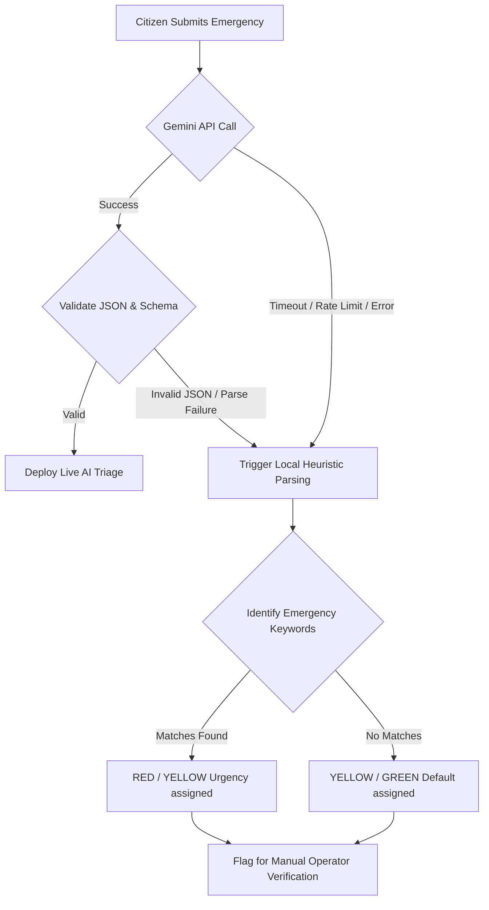

# AI SUBSYSTEMS & INTELLIGENT WORKFLOW DESIGN
## Project: LifeLink AI — Cambodia Intelligent Emergency Medical Response Platform
### Role: Principal AI Research Engineer & Architect
### Document Reference: LLA-AI-DESIGN-2026-V1
### Date: July 7, 2026

---

## 1. EXECUTIVE SUMMARY

LifeLink AI harnesses advanced Generative AI and Large Language Models (LLMs) to automate critical phases of emergency pre-hospital care. This document provides an exhaustive, production-grade specification for every intelligent feature in the platform, deploying Google's modern `@google/genai` API SDK and `gemini-3.5-flash` for server-side processing, alongside structured routing mathematics and orchestration.

---

## 2. CORE AI FUNCTIONAL MODULES

```
                                 +-------------------------+
                                 |  Raw Citizen Reports    |
                                 |  (Text, Audio, Images)  |
                                 +------------+------------+
                                              |
       +--------------------------------------+--------------------------------------+
       |                                      |                                      |
+------v-------+                       +------v-------+                       +------v-------+
| Audio Intake |                       | Visual ER    |                       | Text Intake  |
|  (Whisper/   |                       |  Inspection  |                       |  Parsing &   |
| Gemini STT)  |                       |  (Gemini)    |                       | Translation  |
+------+-------+                       +------+-------+                       +------+-------+
       |                                      |                                      |
       +--------------------------------------+--------------------------------------+
                                              |
                                   +----------v----------+
                                   | Duplicate Detection | (Embedding Cosine Similarity)
                                   +----------+----------+
                                              |
                                   +----------v----------+
                                   |  Triage Classifier  | (Priority Scorer: RED/YELLOW/GREEN)
                                   +----------+----------+
                                              |
                                   +----------v----------+
                                   |  Routing Optimizer  | (ETA & Workload Match Engine)
                                   +---------------------+
```

### 2.1 Multi-Modal Image Severity Assessment
* **Functional Scope**: Bystanders upload photos of wounds, fractures, or traffic collision damage to the 119 Portal.
* **Model Selection**: `gemini-3.5-flash` (Multi-modal capability).
* **AI Task**: Evaluate external anatomical trauma indicators, guess blood loss volume levels, identify hazardous materials, and predict victim counts without violating strict patient HIPAA identities.
* **Privacy/Confidentiality Filter**: The image preprocessing pipeline automatically blanks out facial bounding boxes prior to sending the image vectors to Google Cloud.

### 2.2 Dual-Language Voice Transcription (Speech-To-Text)
* **Functional Scope**: Translates and transcribes fast-paced Khmer or mixed English-Khmer "Karaoke Khmer" voice memos sent by panicked citizens on-scene.
* **Model Selection**: Seamless integration of fine-tuned Whisper API or native Gemini Audio-to-Text.
* **AI Task**: Standardize conversational Cambodian dialect terms into English semantic tokens for the triage matrix while retaining raw translation scripts.
  * *Example Khmer*: "មានរបួសធ្ងន់ធ្ងរ ក្បាលហូរឈាមច្រើន អត់ដឹងខ្លួនទេ"
  * *Standard English translation*: "Severe injury, heavy head bleeding, patient is unconscious."

### 2.3 Comprehensive Emergency Summary & Telemetry Generator
* **Functional Scope**: Automatically compresses massive citizen transcripts, image classifications, and metadata into a standardized, structured 3-line tactical summary for paramedics and ER trauma desks.
* **AI Task**: Generate:
  1. Primary Symptom Vector (e.g., Arterial Bleeding, Traumatic Amputation).
  2. Suspected Internal Hemorrhage risks.
  3. Actionable bystander instructions to guide the scene before paramedic arrival.

### 2.4 Semantic Duplicate Report Detection
* **Functional Scope**: Prevents system-wide dispatch flooding when 30 different witnesses submit reports for the same multi-car pileup on Monivong Boulevard.
* **Mathematical Execution**:
  1. Generate text embeddings ($E_{new}$) using `text-embedding-004` on the incoming incident summary and geographical landmark markers.
  2. Query the PostgreSQL PostGIS database for active incidents ($I_{active}$) within a $150\text{m}$ spatial buffer.
  3. Compute the **Cosine Similarity** matrix against neighboring active report embeddings:
  
$$\text{Similarity} = \frac{E_{new} \cdot E_{active}}{\|E_{new}\| \|E_{active}\|}$$

  4. If $\text{Similarity} \ge 0.84$ AND the distance is under $150\text{m}$, block auto-dispatching, flag the submission as `DUPLICATE_REPORT`, and attach the new citizen's media stream to the existing case file.

### 2.5 Clinical Priority Score Prediction
* **Functional Scope**: Predicts clinical urgency and assigns a normalized triage priority score between $0$ and $100$ using strict clinical rules.
* **AI Task**: Return exact categorical classifications:
  * **RED**: High-probability cardiac arrest, respiratory failure, uncontrolled arterial hemorrhage, or severe penetrative head trauma.
  * **YELLOW**: Compound fractures, moderate burns, stable respiratory distress, or severe pain.
  * **GREEN**: Minor lacerations, stable vital telemetry, cold/flu symptoms, or superficial contusions.

### 2.6 Dynamic Hospital Routing Optimization
* **Functional Scope**: Identifies which of Phnom Penh's five command hospitals is mathematically matched to support the patient, considering:
  1. Specialty alignment (Pediatrics $\rightarrow$ Kantha Bopha, Burns $\rightarrow$ Khmer-Soviet).
  2. Live ER bed capacity counters (ICU Bed Availability).
  3. Physical distance weight.
* **Implementation**: The AI routes details to the nearest node, shifting parameters on the fly as capacities change.

### 2.7 Traffic-Aware Arrival Time (ETA) Prediction
* **Functional Scope**: Predicts exact ambulance travel times to the scene and subsequent transport times to the matched hospital.
* **AI Task**: Apply historical peak traffic delay multipliers mapped to Cambodian festival periods (Water Festival, Pchum Ben) and peak monsoon flooding seasons.

---

## 3. PRODUCTION GEMINI PROMPT SPECIFICATIONS

### 3.1 Server-Side Citizen Report Processing Prompt
```typescript
const CITIZEN_TRIAGE_PROMPT = `
You are LifeLink AI, the official central emergency medical triage intelligence operating for the Ministry of Health in Phnom Penh, Cambodia.
Your task is to analyze the incoming citizen's emergency report, translate any Khmer, slang, or mixed Karaoke Khmer phonetics to English, and extract strict clinical metrics.

Inputs:
- RAW CITIZEN REPORT: "{{citizen_report_text}}"
- REPORTED LOCATION LANDMARK: "{{location_landmark}}"

You MUST output your response strictly as a JSON object, containing no markdown backticks or wrapper characters outside the raw JSON. Follow this exact schema:

{
  "translatedEnglishText": "string - Precise English translation of the report",
  "victimCount": "integer - Number of injured victims, default to 1 if unspecified",
  "primarySymptom": "string - Primary diagnosed injury or symptom in English",
  "suspectedInjuries": ["string" - Array of specific injury tags (e.g. 'fracture', 'arterial_bleeding', 'head_trauma', 'burn')],
  "consciousnessState": "string - Strictly choose from ['Conscious', 'Semi-Conscious', 'Unconscious', 'Unknown']",
  "respirationRate": "string - Strictly choose from ['Normal', 'Labored / Rapid', 'Apnea / Stopped', 'Unknown']",
  "triageLevel": "string - Strictly choose from ['RED', 'YELLOW', 'GREEN']",
  "priorityScore": "integer - Urgency rating from 0 (stable) to 100 (imminent death). Use clinical weights: Unconscious/Apnea=40, Labored=20, Bleeding=20.",
  "bystanderKhmerFirstAid": "string - Clear, point-by-point, imperative first-aid directions in Khmer (e.g. 'សង្កត់លើរបួសដើម្បីឃាត់ឈាម')",
  "bystanderEnglishFirstAid": "string - Clear, point-by-point, imperative first-aid directions in English matching the Khmer directions",
  "clinicalRationale": "string - One sentence explanation of the triage level and priority score assigned"
}

If the user input is fake, testing, blank, or completely unrelated to medical emergencies, default "triageLevel" to "GREEN", "priorityScore" to 10, and set "clinicalRationale" to "Non-emergency or test simulation input detected."
`;
```

### 3.2 MoH Strategic Directive Generator Prompt
```typescript
const MOH_STRATEGIC_ADVISORY_PROMPT = `
You are the Executive LifeLink AI Director for the Ministry of Health, Kingdom of Cambodia.
You must draft a highly formal, confidential operational strategic directive based on the real-time telemetry metrics compiled from Phnom Penh's emergency healthcare grid.

INPUT TELEMETRY:
- Active Incidents Queue: {{active_incidents}}
- Cumulative Cases Handled: {{total_cases}}
- Municipal Average Ambulance Response Time: {{avg_response_time}} mins (Target limit: 15 mins)
- Emergency Fleet Utilization: {{fleet_utilization}}% (Critical threshold: >80%)
- Hospital Trauma ICU Beds Allocation: {{hospital_capacities}}

Write an elegant, formal, confidential administrative directive utilizing the traditional official Cambodian layout format.
Structure your analysis into exactly 3 sections:
1. Grid Status Audit (Synthesize current performance indicators, pointing out any active bottlenecks or critical strains at specific hospital nodes).
2. Automated Routing Efficiency (Assess whether the AI matching engine is successfully routing casualties based on live ICU availability and specialties).
3. Strategic Policy Directives (Outline exactly 3 actionable operational decisions for the Minister of Health, e.g., transferring idle ambulances from underutilized nodes, calling in trauma backup teams, or reserving ICU bed buffers).

Maintain a formal, authoritative, clinical, and patriotic tone. Address the challenges of monsoon flooding and local traffic layouts with precision.
`;
```

---

## 4. CLINICAL SCORES & CONFIDENCE CALCULATION

### 4.1 Confidence Score Formula ($C$)
The system calculates a clinical confidence score for the Gemini model's classification output to flag cases needing human supervision:

$$C = \left( 0.4 \times P_{lang} \right) + \left( 0.4 \times P_{vital} \right) + \left( 0.2 \times P_{loc} \right)$$

Where:
* $P_{lang}$ (Language Clarity Parameter): $1.0$ if the raw text is $> 15$ characters and descriptive, $0.5$ if short, $0.0$ if gibberish.
* $P_{vital}$ (Vital Data Completeness): $1.0$ if both *consciousnessState* and *respirationRate* are extracted, $0.5$ if only one is present, $0.0$ if both are null or "Unknown".
* $P_{loc}$ (Geospatial Pin Accuracy): $1.0$ if GPS coordinate lock exists, $0.2$ if only approximate landmark is given.

*Threshold Action*: If $C < 0.60$, the system forces the incident status to `PENDING_OPERATOR_VERIFICATION` to ensure human review.

---

## 5. ROBUST FALLBACK & ERROR HANDLING ARCHITECTURE

To protect citizen safety, LifeLink AI implements a fail-safe multi-tier recovery pipeline if the LLM backend fails:



### 5.1 Local Triage Heuristic Engine (Code Fallback)
If the API connection drops or credentials are misconfigured, the Node server executes local regex keyword matching to triage the report safely:

```typescript
// Local Fail-Safe Triage Engine
export function localHeuristicTriage(rawText: string): {
  triageLevel: "RED" | "YELLOW" | "GREEN";
  priorityScore: number;
  translatedEnglishText: string;
  khmerInstructions: string;
} {
  const normalized = rawText.toLowerCase();
  
  // Severe conditions
  const redKeywords = ["unconscious", "សន្លប់", "ឈាមច្រើន", "bleeding", "drown", "លង់ទឹក", "not breathing", "អត់ដកដង្ហើម"];
  const yellowKeywords = ["accident", "បុកគ្នា", "fracture", "បាក់ឆ្អឹង", "ឈឺ", "hurt", "fall", "ធ្លាក់"];

  let matchesRed = redKeywords.some(keyword => normalized.includes(keyword));
  let matchesYellow = yellowKeywords.some(keyword => normalized.includes(keyword));

  if (matchesRed) {
    return {
      triageLevel: "RED",
      priorityScore: 85,
      translatedEnglishText: `[Fallback Triage] ${rawText}`,
      khmerInstructions: "រក្សាសន្តិសុខជនរងគ្រោះ។ ធ្វើចលនាទ្រូង (CPR) ប្រសិនបើគាត់មិនដកដង្ហើម។ សង្កត់របួសឃាត់ឈាម។"
    };
  }

  if (matchesYellow) {
    return {
      triageLevel: "YELLOW",
      priorityScore: 50,
      translatedEnglishText: `[Fallback Triage] ${rawText}`,
      khmerInstructions: "កុំផ្លាស់ទីជនរងគ្រោះប្រសិនសង្ស័យបាក់ឆ្អឹង។ លាងសំអាតរបួស។"
    };
  }

  return {
    triageLevel: "GREEN",
    priorityScore: 20,
    translatedEnglishText: `[Fallback Triage] ${rawText}`,
    khmerInstructions: "រក្សាភាពស្ងប់ស្ងាត់។ រង់ចាំរថយន្តសង្គ្រោះមកដល់។"
  };
}
```

---

## 6. MODEL EVALUATION & PERFORMANCE CRITERIA

To maintain clinical standards, the LifeLink AI models are evaluated on a continuous integration framework:

### 6.1 Key Performance Metric Targets
1. **Triage Recall Rate (RED Category)**: Target $\ge 99.2\%$. Under-triaging a critical case (false negative) must be minimized to avoid dispatch delays.
2. **Translation Word Error Rate (WER - Khmer to English)**: Target $< 12\%$.
3. **Structured Schema Compliance**: Target $100\%$. The Gemini output must parse cleanly to prevent system exceptions.

---
*End of AI Feature Design Specification.*
