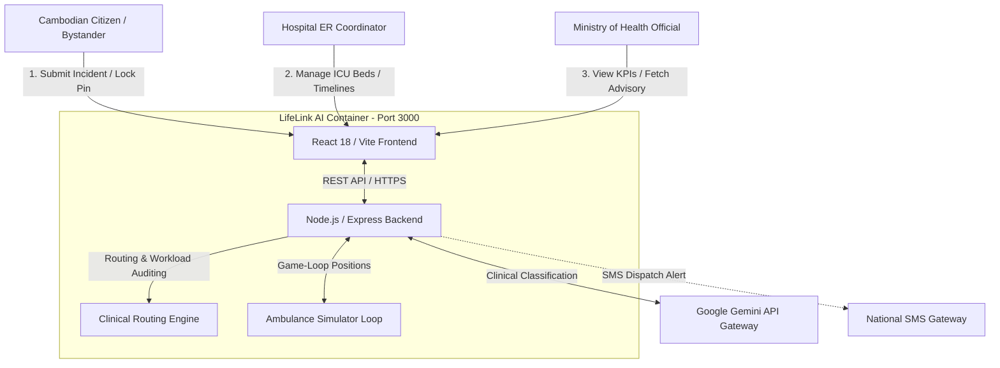
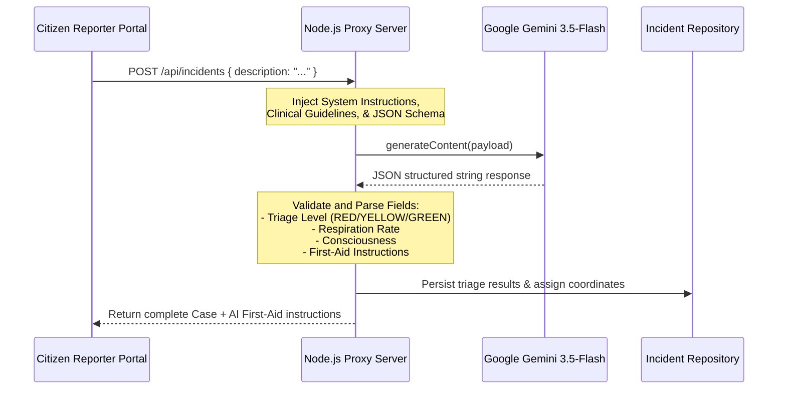
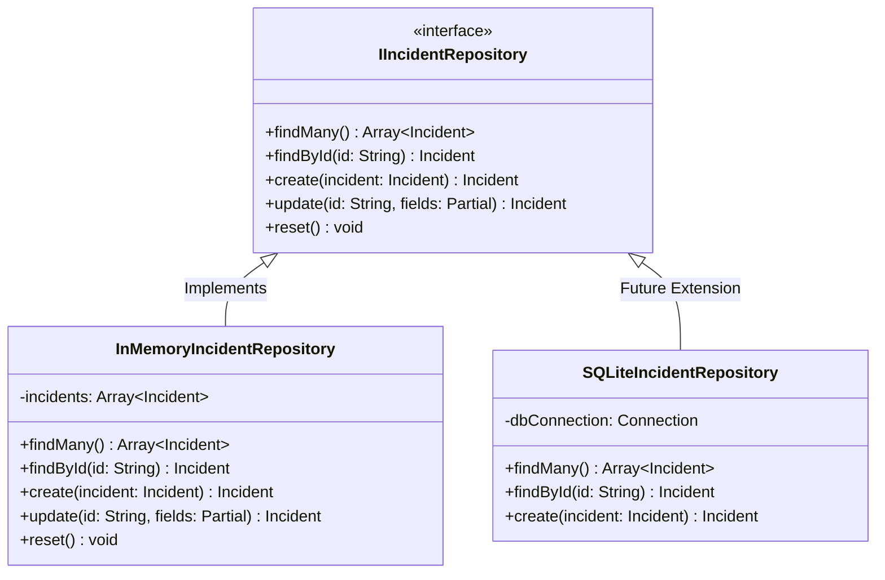

# SYSTEM ARCHITECTURE DESIGN DOCUMENT
## Project: LifeLink AI — Cambodia Intelligent Emergency Medical Response Platform
### Role: Principal Software Architect
### Document Reference: LLA-ARCH-2026-V1
### Date: July 7, 2026

---

## 1. EXECUTIVE ARCHITECTURAL SUMMARY

LifeLink AI is designed as a highly reliable, high-performance, real-time clinical routing and citizen emergency dispatch platform for Phnom Penh, Cambodia. The architecture guarantees sub-second geospatial routing queries, high-throughput ingestion of conversational multi-dialect emergency reports, and automated, server-side clinical triage classification using Google Gemini.

This document details the complete end-to-end architecture, from client-side visual rendering to containerized deployment.

---

## 2. HIGH-LEVEL SYSTEM ARCHITECTURE

The platform employs a **Modular Monolith** pattern to balance development velocity, clean boundaries, and runtime simplicity. Rather than incurring the network overhead and operational complexity of microservices for a municipal health system, logical separation of concerns is strictly enforced inside the codebase using clean architectural boundaries, dependency injection, and data repository patterns.

### 2.1 Enterprise Context Diagram (Mermaid)



---

## 3. ARCHITECTURAL PATTERNS & PRINCIPLES

### 3.1 Design Patterns
1. **Repository Pattern**: Decouples the core business domain logic from data access drivers, allowing seamless switches between local RAM arrays, PostgreSQL, or Firestore databases.
2. **Dependency Injection (DI)**: Business services (e.g., `TriageService`, `RoutingService`) receive their database adapters, LLM models, and notification configurations at instantiation time rather than hardcoding them.
3. **Singleton Pattern**: The `AmbulanceSimulationEngine` operates as a single, centralized game-loop orchestrating geographical coordinates and state transitions across Phnom Penh.

### 3.2 Codebase Folder Structure

The project conforms to a clean, domain-driven modular arrangement:

```
/
├── SRS.md                  # Software Requirements Specification
├── ARCHITECTURE.md          # Systems & Software Architecture (this file)
├── metadata.json           # Application platform configuration
├── package.json            # Deployment dependencies & scripts
├── server.ts               # Full-Stack entry point (Express + Vite)
├── src/
│   ├── main.tsx            # React client entry point
│   ├── App.tsx             # Main client cockpit controller
│   ├── types.ts            # Core TypeScript shared domain models
│   ├── index.css           # Tailwind CSS directives
│   ├── components/         # Modular presentational & interactive views
│   │   ├── PhnomPenhMap.tsx     # Custom SVG vector mapping component
│   │   ├── CitizenReporter.tsx  # Natural Language ingestion & diagnostics
│   │   ├── HospitalCommand.tsx  # Hospital ER capacity manager
│   │   └── MoHDashboard.tsx     # MoH central KPI advisory panel
│   ├── services/           # Backend Core Domain Services
│   │   ├── TriageService.ts     # NLP analysis & priority scoring
│   │   ├── RoutingService.ts    # Mathematical hospital matching
│   │   └── NotificationService.ts # Event dispatch alerts
│   └── repositories/       # Data Access Layer
│       ├── IIncidentRepository.ts # Incident abstract interface
│       └── InMemoryIncidentRepo.ts # Concrete Repository implementation
```

---

## 4. SUBSYSTEM ARCHITECTURES

### 4.1 Frontend Architecture

The user interface layer is built with **React 18** and compiled via **Vite**.

* **State Management**: Governed by React functional hooks and reactive state triggers, polling the backend every 4000ms for real-time visualization of driving vehicles.
* **Geospatial Projection Engine (`PhnomPenhMap`)**: Avoids the performance and battery drain of heavy Mapbox GL layers on standard devices by utilizing an interactive Cartesian Scalable Vector Graphics (SVG) projection coordinate model mapped to exact latitudinal/longitudinal boundary constraints:
  * Minimum Bounds: `11.5200° N`, `104.8800° E`
  * Maximum Bounds: `11.6000° N`, `104.9600° E`
* **Animation**: Leverages `motion` for smooth exit/entry, ticker animations, and pulse visual alerts for critical patient triage statuses.

### 4.2 Backend Architecture

The server-side component is built using **TypeScript on Node.js** backed by an **Express v4** routing layer.

* **Development Mode**: Served using `tsx` to run TypeScript instantly.
* **Production Build Phase**: Optimized via `esbuild` into a self-contained, high-performance CommonJS bundle (`dist/server.cjs`), eliminating file-system lookup lags on cold starts in container systems.

### 4.3 AI Architecture (Natural Language & Decisions)

The artificial intelligence subsystem uses the official **@google/genai** TypeScript SDK, interfacing directly with `gemini-3.5-flash` on the server-side to hide secure access keys.



### 4.4 Database Architecture & Repository Pattern



The system uses an abstract repository mapping layout to completely separate persistent storage engines from core clinical routing math. If the system scales to handle millions of national records, the data adapter can be swapped with a PostgreSQL/Firestore database in the service container with zero impact on the frontend or routing modules.

### 4.5 Notification Subsystem

To optimize system resource usage, a multi-tier event notification flow is established:
1. **Critical Live Notifications**: Express SSE (Server-Sent Events) channels stream instant audio-visual pulses directly to local Hospital Node dashboards when incoming cases are classified as RED triage.
2. **SMS Dispatch Interface**: Integrates with national cellular networks to instantly deliver route instructions and trauma-patient profiles directly to assigned paramedic cellphones.

---

## 5. RE-ROUTING DECISION & MATHEMATICAL WEIGHTS

The clinical routing algorithm computes an optimal score for each hospital based on multiple parameters, prioritizing specialty match and live ICU resources to protect patient outcomes.

### 5.1 Mathematical Routing Weight Function
Given:
* $D$ = Euclidean physical distance between the incident coordinates $(x_{inc}, y_{inc})$ and hospital coordinates $(x_{hosp}, y_{hosp})$.
* $S_{match}$ = Specialty match multiplier. If the patient's parsed symptoms match a hospital's designated special capabilities (e.g., Pediatrics for Kantha Bopha, Cardiology for Royal Phnom Penh), $S_{match} = 2.0$, else $S_{match} = 1.0$.
* $ICU_{avail}$ = Number of available trauma ICU beds at the hospital.
* $Amb_{avail}$ = Number of available responder ambulances at the hospital.

$$\text{Routing Score} = \frac{100 \times S_{match}}{D + 0.01} + (ICU_{avail} \times 15) + (Amb_{avail} \times 10)$$

If $ICU_{avail} = 0$, an exponential penalty is applied to the final score to ensure patients are not routed to a saturated trauma ward:

$$\text{Routing Score}_{\text{Penalized}} = \text{Routing Score} \times e^{-5}$$

---

## 6. DEPLOYMENT & INFRASTRUCTURE TOPOLOGY

LifeLink AI is built to deploy onto modern container orchestration environments like **Google Cloud Run** for dynamic scale-to-zero efficiency during low-strain hours.


---
*End of Architecture Design Document.*
