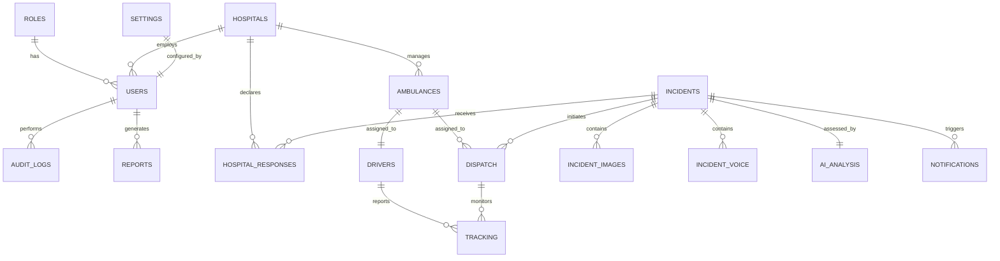

# PRODUCTION POSTGRESQL DATABASE DESIGN SPECIFICATION
## Project: LifeLink AI — Cambodia Intelligent Emergency Medical Response Platform
### Role: Lead Database Architect & Administrator
### Document Reference: LLA-DB-SCHEMA-2026-V1
### Date: July 7, 2026

---

## 1. DATABASE DESIGN OVERVIEW

This document presents the production-grade PostgreSQL database schema designed for **LifeLink AI**. The schema is optimized for real-time tracking, sub-second GIS queries, clinical load calculations, and deep audit traceability. 

### 1.1 Key Architecture Goals
1. **Sub-second Geo-Queries**: Leveraging PostgreSQL **PostGIS** spatial indexes to determine physical ambulance and incident proximity.
2. **Third Normal Form (3NF)**: Structured to eliminate redundant telemetry logs and preserve transaction consistency.
3. **Auditability**: Secure, tamper-evident write-heavy log structures to audit automated routing decisions and manual dispatcher overrides.
4. **Resiliency and Strict Typings**: Extensive use of custom PostgreSQL enumerations (`ENUM`), check constraints (`CHECK`), foreign keys (`FOREIGN KEY ON DELETE RESTRICT/CASCADE`), and optimized index paths.

---

## 2. ENTITY-RELATIONSHIP (ER) DIAGRAM



---

## 3. PRODUCTION DDL SQL SCHEMA (POSTGRESQL 15+)

This SQL schema defines all tables, custom enumerations, primary/foreign keys, indices, spatial geometry extensions, and check constraints required to build the database.

```sql
-- LifeLink AI Production Database Bootstrapping
-- Target Engine: PostgreSQL 15 or higher

-- Enable GIS extensions for spatial routing computations
CREATE EXTENSION IF NOT EXISTS postgis;
CREATE EXTENSION IF NOT EXISTS "uuid-ossp";

-- Define Custom Enum Types
CREATE TYPE user_status_type AS ENUM ('ACTIVE', 'SUSPENDED', 'ON_LEAVE');
CREATE TYPE triage_level_type AS ENUM ('RED', 'YELLOW', 'GREEN');
CREATE TYPE ambulance_status_type AS ENUM ('AVAILABLE', 'DISPATCHED', 'ON_SCENE', 'TRANSPORTING', 'MAINTENANCE', 'OFF_DUTY');
CREATE TYPE dispatch_status_type AS ENUM ('REQUESTED', 'ACCEPTED', 'EN_ROUTE', 'ARRIVED_SCENE', 'ARRIVED_HOSPITAL', 'CANCELLED', 'COMPLETED');
CREATE TYPE notification_channel_type AS ENUM ('SMS', 'SSE', 'PUSH', 'EMAIL');

-- -------------------------------------------------------------
-- 1. Roles Table
-- -------------------------------------------------------------
CREATE TABLE roles (
    id UUID PRIMARY KEY DEFAULT uuid_generate_v4(),
    name VARCHAR(50) UNIQUE NOT NULL,
    description TEXT,
    created_at TIMESTAMP WITH TIME ZONE DEFAULT CURRENT_TIMESTAMP NOT NULL,
    updated_at TIMESTAMP WITH TIME ZONE DEFAULT CURRENT_TIMESTAMP NOT NULL
);

-- -------------------------------------------------------------
-- 2. Hospitals Table
-- -------------------------------------------------------------
CREATE TABLE hospitals (
    id UUID PRIMARY KEY DEFAULT uuid_generate_v4(),
    name VARCHAR(150) NOT NULL,
    name_khmer VARCHAR(200) NOT NULL,
    address TEXT NOT NULL,
    phone_number VARCHAR(30) NOT NULL,
    total_icu_beds INTEGER NOT NULL CONSTRAINT chk_total_beds CHECK (total_icu_beds >= 0),
    available_icu_beds INTEGER NOT NULL CONSTRAINT chk_avail_beds CHECK (available_icu_beds <= total_icu_beds AND available_icu_beds >= 0),
    total_ambulances INTEGER DEFAULT 0 NOT NULL CONSTRAINT chk_total_amb CHECK (total_ambulances >= 0),
    specialties VARCHAR(50)[] NOT NULL, -- Array of specialized medical codes
    location GEOMETRY(Point, 4326) NOT NULL, -- PostGIS Coordinate Point (Lat/Long)
    created_at TIMESTAMP WITH TIME ZONE DEFAULT CURRENT_TIMESTAMP NOT NULL,
    updated_at TIMESTAMP WITH TIME ZONE DEFAULT CURRENT_TIMESTAMP NOT NULL
);

-- -------------------------------------------------------------
-- 3. Users Table
-- -------------------------------------------------------------
CREATE TABLE users (
    id UUID PRIMARY KEY DEFAULT uuid_generate_v4(),
    role_id UUID NOT NULL REFERENCES roles(id) ON DELETE RESTRICT,
    hospital_id UUID REFERENCES hospitals(id) ON DELETE SET NULL, -- Null if MoH or System Administrator
    username VARCHAR(50) UNIQUE NOT NULL,
    email VARCHAR(100) UNIQUE NOT NULL,
    password_hash VARCHAR(255) NOT NULL,
    full_name VARCHAR(100) NOT NULL,
    phone_number VARCHAR(30),
    status user_status_type DEFAULT 'ACTIVE' NOT NULL,
    last_login TIMESTAMP WITH TIME ZONE,
    created_at TIMESTAMP WITH TIME ZONE DEFAULT CURRENT_TIMESTAMP NOT NULL,
    updated_at TIMESTAMP WITH TIME ZONE DEFAULT CURRENT_TIMESTAMP NOT NULL
);

-- -------------------------------------------------------------
-- 4. Drivers Table
-- -------------------------------------------------------------
CREATE TABLE drivers (
    id UUID PRIMARY KEY DEFAULT uuid_generate_v4(),
    user_id UUID UNIQUE NOT NULL REFERENCES users(id) ON DELETE CASCADE,
    license_number VARCHAR(50) UNIQUE NOT NULL,
    blood_type VARCHAR(5),
    is_active BOOLEAN DEFAULT TRUE NOT NULL,
    created_at TIMESTAMP WITH TIME ZONE DEFAULT CURRENT_TIMESTAMP NOT NULL,
    updated_at TIMESTAMP WITH TIME ZONE DEFAULT CURRENT_TIMESTAMP NOT NULL
);

-- -------------------------------------------------------------
-- 5. Ambulances Table
-- -------------------------------------------------------------
CREATE TABLE ambulances (
    id UUID PRIMARY KEY DEFAULT uuid_generate_v4(),
    hospital_id UUID NOT NULL REFERENCES hospitals(id) ON DELETE RESTRICT,
    assigned_driver_id UUID UNIQUE REFERENCES drivers(id) ON DELETE SET NULL,
    plate_number VARCHAR(30) UNIQUE NOT NULL,
    vin VARCHAR(50) UNIQUE,
    equipment_level VARCHAR(50) NOT NULL DEFAULT 'ALS', -- Advanced Life Support / Basic Life Support
    status ambulance_status_type DEFAULT 'AVAILABLE' NOT NULL,
    current_location GEOMETRY(Point, 4326), -- PostGIS Spatial Coordinate Point
    created_at TIMESTAMP WITH TIME ZONE DEFAULT CURRENT_TIMESTAMP NOT NULL,
    updated_at TIMESTAMP WITH TIME ZONE DEFAULT CURRENT_TIMESTAMP NOT NULL
);

-- -------------------------------------------------------------
-- 6. Incidents Table
-- -------------------------------------------------------------
CREATE TABLE incidents (
    id UUID PRIMARY KEY DEFAULT uuid_generate_v4(),
    reported_by_username VARCHAR(100) NOT NULL,
    reporter_phone VARCHAR(30) NOT NULL,
    raw_text TEXT NOT NULL, -- Citizen's input text (Khmer/English)
    location_name VARCHAR(255) NOT NULL,
    location GEOMETRY(Point, 4326) NOT NULL, -- PostGIS Coordinate Point
    patient_count INTEGER DEFAULT 1 NOT NULL CONSTRAINT chk_patient_count CHECK (patient_count > 0),
    triage_level triage_level_type,
    priority_score INTEGER CONSTRAINT chk_priority_score CHECK (priority_score >= 0 AND priority_score <= 100),
    status VARCHAR(50) DEFAULT 'REPORTED' NOT NULL,
    assigned_hospital_id UUID REFERENCES hospitals(id) ON DELETE SET NULL,
    reported_at TIMESTAMP WITH TIME ZONE DEFAULT CURRENT_TIMESTAMP NOT NULL,
    resolved_at TIMESTAMP WITH TIME ZONE
);

-- -------------------------------------------------------------
-- 7. Incident Images Table
-- -------------------------------------------------------------
CREATE TABLE incident_images (
    id UUID PRIMARY KEY DEFAULT uuid_generate_v4(),
    incident_id UUID NOT NULL REFERENCES incidents(id) ON DELETE CASCADE,
    image_url TEXT NOT NULL,
    caption TEXT,
    uploaded_at TIMESTAMP WITH TIME ZONE DEFAULT CURRENT_TIMESTAMP NOT NULL
);

-- -------------------------------------------------------------
-- 8. Incident Voice Table
-- -------------------------------------------------------------
CREATE TABLE incident_voice (
    id UUID PRIMARY KEY DEFAULT uuid_generate_v4(),
    incident_id UUID NOT NULL REFERENCES incidents(id) ON DELETE CASCADE,
    audio_url TEXT NOT NULL,
    duration_seconds INTEGER NOT NULL,
    transcript TEXT, -- Transcribed Khmer/English translation
    uploaded_at TIMESTAMP WITH TIME ZONE DEFAULT CURRENT_TIMESTAMP NOT NULL
);

-- -------------------------------------------------------------
-- 9. AI Analysis Table
-- -------------------------------------------------------------
CREATE TABLE ai_analysis (
    id UUID PRIMARY KEY DEFAULT uuid_generate_v4(),
    incident_id UUID UNIQUE NOT NULL REFERENCES incidents(id) ON DELETE CASCADE,
    model_version VARCHAR(50) DEFAULT 'gemini-3.5-flash' NOT NULL,
    symptoms VARCHAR(100)[] NOT NULL,
    suspected_injuries VARCHAR(100)[] NOT NULL,
    respiration_state VARCHAR(100) NOT NULL,
    consciousness_state VARCHAR(100) NOT NULL,
    khmer_first_aid_instructions TEXT NOT NULL,
    english_first_aid_instructions TEXT NOT NULL,
    confidence_score NUMERIC(5, 2) NOT NULL CONSTRAINT chk_confidence CHECK (confidence_score >= 0.0 AND confidence_score <= 100.0),
    computed_at TIMESTAMP WITH TIME ZONE DEFAULT CURRENT_TIMESTAMP NOT NULL
);

-- -------------------------------------------------------------
-- 10. Dispatches (Core Transaction Lifecycle)
-- -------------------------------------------------------------
CREATE TABLE dispatches (
    id UUID PRIMARY KEY DEFAULT uuid_generate_v4(),
    incident_id UUID NOT NULL REFERENCES incidents(id) ON DELETE RESTRICT,
    ambulance_id UUID NOT NULL REFERENCES ambulances(id) ON DELETE RESTRICT,
    assigned_by_user_id UUID REFERENCES users(id) ON DELETE SET NULL,
    status dispatch_status_type DEFAULT 'REQUESTED' NOT NULL,
    dispatched_at TIMESTAMP WITH TIME ZONE DEFAULT CURRENT_TIMESTAMP NOT NULL,
    en_route_at TIMESTAMP WITH TIME ZONE,
    on_scene_at TIMESTAMP WITH TIME ZONE,
    hospital_arrival_at TIMESTAMP WITH TIME ZONE,
    completed_at TIMESTAMP WITH TIME ZONE
);

-- -------------------------------------------------------------
-- 11. Hospital Responses (Capacity Agreements)
-- -------------------------------------------------------------
CREATE TABLE hospital_responses (
    id UUID PRIMARY KEY DEFAULT uuid_generate_v4(),
    hospital_id UUID NOT NULL REFERENCES hospitals(id) ON DELETE CASCADE,
    incident_id UUID NOT NULL REFERENCES incidents(id) ON DELETE CASCADE,
    is_accepted BOOLEAN NOT NULL DEFAULT TRUE,
    response_note TEXT,
    responded_at TIMESTAMP WITH TIME ZONE DEFAULT CURRENT_TIMESTAMP NOT NULL
);

-- -------------------------------------------------------------
-- 12. Real-Time Tracking Telemetry Table
-- -------------------------------------------------------------
CREATE TABLE tracking (
    id BIGSERIAL PRIMARY KEY,
    dispatch_id UUID NOT NULL REFERENCES dispatches(id) ON DELETE CASCADE,
    ambulance_id UUID NOT NULL REFERENCES ambulances(id) ON DELETE CASCADE,
    location GEOMETRY(Point, 4326) NOT NULL,
    speed_kmh NUMERIC(5, 2),
    bearing NUMERIC(5, 2), -- Degrees (0 - 360)
    heart_rate_telemetry INTEGER, -- Simulated patient monitoring values
    oxygen_saturation_telemetry INTEGER,
    logged_at TIMESTAMP WITH TIME ZONE DEFAULT CURRENT_TIMESTAMP NOT NULL
);

-- -------------------------------------------------------------
-- 13. Notifications Logs
-- -------------------------------------------------------------
CREATE TABLE notifications (
    id UUID PRIMARY KEY DEFAULT uuid_generate_v4(),
    user_id UUID REFERENCES users(id) ON DELETE CASCADE, -- Recipient user
    incident_id UUID REFERENCES incidents(id) ON DELETE SET NULL,
    channel notification_channel_type DEFAULT 'SSE' NOT NULL,
    payload JSONB NOT NULL,
    is_read BOOLEAN DEFAULT FALSE NOT NULL,
    sent_at TIMESTAMP WITH TIME ZONE DEFAULT CURRENT_TIMESTAMP NOT NULL
);

-- -------------------------------------------------------------
-- 14. Audit Logs (Compliance & Monitoring)
-- -------------------------------------------------------------
CREATE TABLE audit_logs (
    id UUID PRIMARY KEY DEFAULT uuid_generate_v4(),
    user_id UUID REFERENCES users(id) ON DELETE SET NULL,
    action VARCHAR(100) NOT NULL,
    table_name VARCHAR(100) NOT NULL,
    record_id UUID NOT NULL,
    old_value JSONB,
    new_value JSONB,
    ip_address VARCHAR(45),
    performed_at TIMESTAMP WITH TIME ZONE DEFAULT CURRENT_TIMESTAMP NOT NULL
);

-- -------------------------------------------------------------
-- 15. Settings Table
-- -------------------------------------------------------------
CREATE TABLE settings (
    id UUID PRIMARY KEY DEFAULT uuid_generate_v4(),
    updated_by_user_id UUID REFERENCES users(id) ON DELETE SET NULL,
    routing_algorithm_mode VARCHAR(50) DEFAULT 'SPECIALTY_AND_BEDS' NOT NULL,
    distance_weight_factor NUMERIC(3, 2) DEFAULT 1.0 NOT NULL,
    bed_capacity_weight_factor NUMERIC(3, 2) DEFAULT 1.0 NOT NULL,
    auto_dispatch_enabled BOOLEAN DEFAULT TRUE NOT NULL,
    updated_at TIMESTAMP WITH TIME ZONE DEFAULT CURRENT_TIMESTAMP NOT NULL
);

-- -------------------------------------------------------------
-- 16. Reports Table
-- -------------------------------------------------------------
CREATE TABLE reports (
    id UUID PRIMARY KEY DEFAULT uuid_generate_v4(),
    generated_by_user_id UUID NOT NULL REFERENCES users(id) ON DELETE RESTRICT,
    title VARCHAR(150) NOT NULL,
    report_type VARCHAR(50) NOT NULL, -- "MOH_WEEKLY", "CAPACITY_AUDIT"
    summary TEXT,
    data JSONB NOT NULL,
    created_at TIMESTAMP WITH TIME ZONE DEFAULT CURRENT_TIMESTAMP NOT NULL
);

-- =============================================================
-- PERFORMANCE INDEXES DESIGN
-- =============================================================

-- PostGIS Spatial Indexes
CREATE INDEX idx_hospitals_location ON hospitals USING GIST(location);
CREATE INDEX idx_ambulances_location ON ambulances USING GIST(current_location);
CREATE INDEX idx_incidents_location ON incidents USING GIST(location);
CREATE INDEX idx_tracking_location ON tracking USING GIST(location);

-- Fast Lookups for Foreign Keys and Relationships
CREATE INDEX idx_users_role_id ON users(role_id);
CREATE INDEX idx_users_hospital_id ON users(hospital_id);
CREATE INDEX idx_ambulances_hospital_id ON ambulances(hospital_id);
CREATE INDEX idx_incidents_status ON incidents(status);
CREATE INDEX idx_dispatches_incident_id ON dispatches(incident_id);
CREATE INDEX idx_dispatches_ambulance_id ON dispatches(ambulance_id);
CREATE INDEX idx_tracking_dispatch_id ON tracking(dispatch_id);
CREATE INDEX idx_tracking_logged_at ON tracking(logged_at DESC);
CREATE INDEX idx_notifications_user_id_unread ON notifications(user_id) WHERE is_read = FALSE;
CREATE INDEX idx_audit_performed_at ON audit_logs(performed_at DESC);
```

---

## 4. PRODUCT-READY SQLALCHEMY MODELS (PYTHON ORM)

Below is the production-ready code structure translating the PostgreSQL schema layout to modern **SQLAlchemy 2.0** declarations. It incorporates explicit schema-level relationship maps, GIS column support, validation checks, and enum translation.

```python
import uuid
from datetime import datetime
from typing import List, Optional
from sqlalchemy import (
    Column, String, Integer, Boolean, ForeignKey, Text, 
    TIMESTAMP, Numeric, Enum as SqlEnum, Table, CheckConstraint, Index
)
from sqlalchemy.dialects.postgresql import UUID, JSONB, ARRAY
from sqlalchemy.orm import DeclarativeBase, Mapped, mapped_column, relationship
from geoalchemy2 import Geometry

# Standard Declarative base model class
class Base(DeclarativeBase):
    pass

# Custom Enum mapping declarations matching PostgreSQL Types
import enum

class UserStatus(enum.Enum):
    ACTIVE = "ACTIVE"
    SUSPENDED = "SUSPENDED"
    ON_LEAVE = "ON_LEAVE"

class TriageLevel(enum.Enum):
    RED = "RED"
    YELLOW = "YELLOW"
    GREEN = "GREEN"

class AmbulanceStatus(enum.Enum):
    AVAILABLE = "AVAILABLE"
    DISPATCHED = "DISPATCHED"
    ON_SCENE = "ON_SCENE"
    TRANSPORTING = "TRANSPORTING"
    MAINTENANCE = "MAINTENANCE"
    OFF_DUTY = "OFF_DUTY"

class DispatchStatus(enum.Enum):
    REQUESTED = "REQUESTED"
    ACCEPTED = "ACCEPTED"
    EN_ROUTE = "EN_ROUTE"
    ARRIVED_SCENE = "ARRIVED_SCENE"
    ARRIVED_HOSPITAL = "ARRIVED_HOSPITAL"
    CANCELLED = "CANCELLED"
    COMPLETED = "COMPLETED"

class NotificationChannel(enum.Enum):
    SMS = "SMS"
    SSE = "SSE"
    PUSH = "PUSH"
    EMAIL = "EMAIL"


# -------------------------------------------------------------
# 1. Role Class Model
# -------------------------------------------------------------
class Role(Base):
    __tablename__ = "roles"

    id: Mapped[uuid.UUID] = mapped_column(UUID(as_uuid=True), primary_key=True, default=uuid.uuid4)
    name: Mapped[str] = mapped_column(String(50), unique=True, nullable=False)
    description: Mapped[Optional[str]] = mapped_column(Text)
    created_at: Mapped[datetime] = mapped_column(TIMESTAMP(timezone=True), default=datetime.utcnow)
    updated_at: Mapped[datetime] = mapped_column(TIMESTAMP(timezone=True), default=datetime.utcnow, onupdate=datetime.utcnow)

    # Relationships
    users: Mapped[List["User"]] = relationship("User", back_populates="role")


# -------------------------------------------------------------
# 2. Hospital Class Model
# -------------------------------------------------------------
class Hospital(Base):
    __tablename__ = "hospitals"

    id: Mapped[uuid.UUID] = mapped_column(UUID(as_uuid=True), primary_key=True, default=uuid.uuid4)
    name: Mapped[str] = mapped_column(String(150), nullable=False)
    name_khmer: Mapped[str] = mapped_column(String(200), nullable=False)
    address: Mapped[str] = mapped_column(Text, nullable=False)
    phone_number: Mapped[str] = mapped_column(String(30), nullable=False)
    total_icu_beds: Mapped[int] = mapped_column(Integer, nullable=False)
    available_icu_beds: Mapped[int] = mapped_column(Integer, nullable=False)
    total_ambulances: Mapped[int] = mapped_column(Integer, default=0, nullable=False)
    specialties: Mapped[List[str]] = mapped_column(ARRAY(String(50)), nullable=False)
    
    # PostGIS Location spatial column
    location = Column(Geometry(geometry_type="POINT", srid=4326), nullable=False)

    created_at: Mapped[datetime] = mapped_column(TIMESTAMP(timezone=True), default=datetime.utcnow)
    updated_at: Mapped[datetime] = mapped_column(TIMESTAMP(timezone=True), default=datetime.utcnow, onupdate=datetime.utcnow)

    # Constraints
    __table_args__ = (
        CheckConstraint("total_icu_beds >= 0", name="chk_total_beds"),
        CheckConstraint("available_icu_beds <= total_icu_beds AND available_icu_beds >= 0", name="chk_avail_beds"),
        CheckConstraint("total_ambulances >= 0", name="chk_total_amb"),
    )

    # Relationships
    ambulances: Mapped[List["Ambulance"]] = relationship("Ambulance", back_populates="hospital")
    employees: Mapped[List["User"]] = relationship("User", back_populates="hospital")


# -------------------------------------------------------------
# 3. User Class Model
# -------------------------------------------------------------
class User(Base):
    __tablename__ = "users"

    id: Mapped[uuid.UUID] = mapped_column(UUID(as_uuid=True), primary_key=True, default=uuid.uuid4)
    role_id: Mapped[uuid.UUID] = mapped_column(ForeignKey("roles.id", ondelete="RESTRICT"), nullable=False)
    hospital_id: Mapped[Optional[uuid.UUID]] = mapped_column(ForeignKey("hospitals.id", ondelete="SET NULL"))
    username: Mapped[str] = mapped_column(String(50), unique=True, nullable=False)
    email: Mapped[str] = mapped_column(String(100), unique=True, nullable=False)
    password_hash: Mapped[str] = mapped_column(String(255), nullable=False)
    full_name: Mapped[str] = mapped_column(String(100), nullable=False)
    phone_number: Mapped[Optional[str]] = mapped_column(String(30))
    status: Mapped[UserStatus] = mapped_column(SqlEnum(UserStatus), default=UserStatus.ACTIVE)
    last_login: Mapped[Optional[datetime]] = mapped_column(TIMESTAMP(timezone=True))
    created_at: Mapped[datetime] = mapped_column(TIMESTAMP(timezone=True), default=datetime.utcnow)
    updated_at: Mapped[datetime] = mapped_column(TIMESTAMP(timezone=True), default=datetime.utcnow, onupdate=datetime.utcnow)

    # Relationships
    role: Mapped["Role"] = relationship("Role", back_populates="users")
    hospital: Mapped[Optional["Hospital"]] = relationship("Hospital", back_populates="employees")
    driver_profile: Mapped[Optional["Driver"]] = relationship("Driver", back_populates="user", uselist=False)


# -------------------------------------------------------------
# 4. Driver Class Model
# -------------------------------------------------------------
class Driver(Base):
    __tablename__ = "drivers"

    id: Mapped[uuid.UUID] = mapped_column(UUID(as_uuid=True), primary_key=True, default=uuid.uuid4)
    user_id: Mapped[uuid.UUID] = mapped_column(ForeignKey("users.id", ondelete="CASCADE"), unique=True, nullable=False)
    license_number: Mapped[str] = mapped_column(String(50), unique=True, nullable=False)
    blood_type: Mapped[Optional[str]] = mapped_column(String(5))
    is_active: Mapped[bool] = mapped_column(Boolean, default=True)
    created_at: Mapped[datetime] = mapped_column(TIMESTAMP(timezone=True), default=datetime.utcnow)
    updated_at: Mapped[datetime] = mapped_column(TIMESTAMP(timezone=True), default=datetime.utcnow, onupdate=datetime.utcnow)

    # Relationships
    user: Mapped["User"] = relationship("User", back_populates="driver_profile")
    ambulance: Mapped[Optional["Ambulance"]] = relationship("Ambulance", back_populates="assigned_driver", uselist=False)


# -------------------------------------------------------------
# 5. Ambulance Class Model
# -------------------------------------------------------------
class Ambulance(Base):
    __tablename__ = "ambulances"

    id: Mapped[uuid.UUID] = mapped_column(UUID(as_uuid=True), primary_key=True, default=uuid.uuid4)
    hospital_id: Mapped[uuid.UUID] = mapped_column(ForeignKey("hospitals.id", ondelete="RESTRICT"), nullable=False)
    assigned_driver_id: Mapped[Optional[uuid.UUID]] = mapped_column(ForeignKey("drivers.id", ondelete="SET NULL"), unique=True)
    plate_number: Mapped[str] = mapped_column(String(30), unique=True, nullable=False)
    vin: Mapped[Optional[str]] = mapped_column(String(50), unique=True)
    equipment_level: Mapped[str] = mapped_column(String(50), default="ALS")
    status: Mapped[AmbulanceStatus] = mapped_column(SqlEnum(AmbulanceStatus), default=AmbulanceStatus.AVAILABLE)
    
    # Spatial coordinates
    current_location = Column(Geometry(geometry_type="POINT", srid=4326))

    created_at: Mapped[datetime] = mapped_column(TIMESTAMP(timezone=True), default=datetime.utcnow)
    updated_at: Mapped[datetime] = mapped_column(TIMESTAMP(timezone=True), default=datetime.utcnow, onupdate=datetime.utcnow)

    # Relationships
    hospital: Mapped["Hospital"] = relationship("Hospital", back_populates="ambulances")
    assigned_driver: Mapped[Optional["Driver"]] = relationship("Driver", back_populates="ambulance")


# -------------------------------------------------------------
# 6. Incident Class Model
# -------------------------------------------------------------
class Incident(Base):
    __tablename__ = "incidents"

    id: Mapped[uuid.UUID] = mapped_column(UUID(as_uuid=True), primary_key=True, default=uuid.uuid4)
    reported_by_username: Mapped[str] = mapped_column(String(100), nullable=False)
    reporter_phone: Mapped[str] = mapped_column(String(30), nullable=False)
    raw_text: Mapped[str] = mapped_column(Text, nullable=False)
    location_name: Mapped[str] = mapped_column(String(255), nullable=False)
    
    location = Column(Geometry(geometry_type="POINT", srid=4326), nullable=False)
    
    patient_count: Mapped[int] = mapped_column(Integer, default=1, nullable=False)
    triage_level: Mapped[Optional[TriageLevel]] = mapped_column(SqlEnum(TriageLevel))
    priority_score: Mapped[Optional[int]] = mapped_column(Integer)
    status: Mapped[str] = mapped_column(String(50), default="REPORTED")
    assigned_hospital_id: Mapped[Optional[uuid.UUID]] = mapped_column(ForeignKey("hospitals.id", ondelete="SET NULL"))
    reported_at: Mapped[datetime] = mapped_column(TIMESTAMP(timezone=True), default=datetime.utcnow)
    resolved_at: Mapped[Optional[datetime]] = mapped_column(TIMESTAMP(timezone=True))

    __table_args__ = (
        CheckConstraint("patient_count > 0", name="chk_patient_count"),
        CheckConstraint("priority_score >= 0 AND priority_score <= 100", name="chk_priority_score"),
    )

    # Relationships
    images: Mapped[List["IncidentImage"]] = relationship("IncidentImage", back_populates="incident")
    voice_memos: Mapped[List["IncidentVoice"]] = relationship("IncidentVoice", back_populates="incident")
    ai_analysis: Mapped[Optional["AIAnalysis"]] = relationship("AIAnalysis", back_populates="incident", uselist=False)


# -------------------------------------------------------------
# 7. Incident Image Class Model
# -------------------------------------------------------------
class IncidentImage(Base):
    __tablename__ = "incident_images"

    id: Mapped[uuid.UUID] = mapped_column(UUID(as_uuid=True), primary_key=True, default=uuid.uuid4)
    incident_id: Mapped[uuid.UUID] = mapped_column(ForeignKey("incidents.id", ondelete="CASCADE"), nullable=False)
    image_url: Mapped[str] = mapped_column(Text, nullable=False)
    caption: Mapped[Optional[str]] = mapped_column(Text)
    uploaded_at: Mapped[datetime] = mapped_column(TIMESTAMP(timezone=True), default=datetime.utcnow)

    # Relationships
    incident: Mapped["Incident"] = relationship("Incident", back_populates="images")


# -------------------------------------------------------------
# 8. Incident Voice Class Model
# -------------------------------------------------------------
class IncidentVoice(Base):
    __tablename__ = "incident_voice"

    id: Mapped[uuid.UUID] = mapped_column(UUID(as_uuid=True), primary_key=True, default=uuid.uuid4)
    incident_id: Mapped[uuid.UUID] = mapped_column(ForeignKey("incidents.id", ondelete="CASCADE"), nullable=False)
    audio_url: Mapped[str] = mapped_column(Text, nullable=False)
    duration_seconds: Mapped[int] = mapped_column(Integer, nullable=False)
    transcript: Mapped[Optional[str]] = mapped_column(Text)
    uploaded_at: Mapped[datetime] = mapped_column(TIMESTAMP(timezone=True), default=datetime.utcnow)

    # Relationships
    incident: Mapped["Incident"] = relationship("Incident", back_populates="voice_memos")


# -------------------------------------------------------------
# 9. AI Analysis Class Model
# -------------------------------------------------------------
class AIAnalysis(Base):
    __tablename__ = "ai_analysis"

    id: Mapped[uuid.UUID] = mapped_column(UUID(as_uuid=True), primary_key=True, default=uuid.uuid4)
    incident_id: Mapped[uuid.UUID] = mapped_column(ForeignKey("incidents.id", ondelete="CASCADE"), unique=True, nullable=False)
    model_version: Mapped[str] = mapped_column(String(50), default="gemini-3.5-flash")
    symptoms: Mapped[List[str]] = mapped_column(ARRAY(String(100)), nullable=False)
    suspected_injuries: Mapped[List[str]] = mapped_column(ARRAY(String(100)), nullable=False)
    respiration_state: Mapped[str] = mapped_column(String(100), nullable=False)
    consciousness_state: Mapped[str] = mapped_column(String(100), nullable=False)
    khmer_first_aid_instructions: Mapped[str] = mapped_column(Text, nullable=False)
    english_first_aid_instructions: Mapped[str] = mapped_column(Text, nullable=False)
    confidence_score: Mapped[float] = mapped_column(Numeric(5, 2), nullable=False)

    __table_args__ = (
        CheckConstraint("confidence_score >= 0.0 AND confidence_score <= 100.0", name="chk_confidence"),
    )

    # Relationships
    incident: Mapped["Incident"] = relationship("Incident", back_populates="ai_analysis")
```

---
*End of PostgreSQL Production Database Schema Design.*
