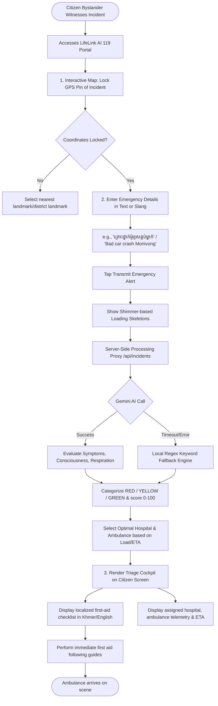
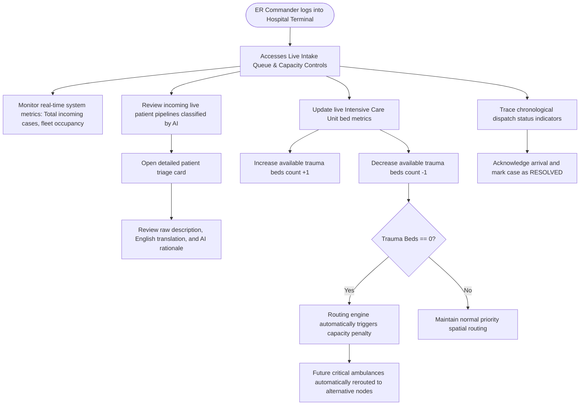
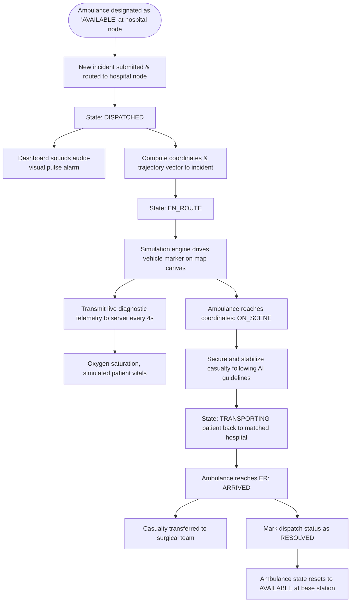
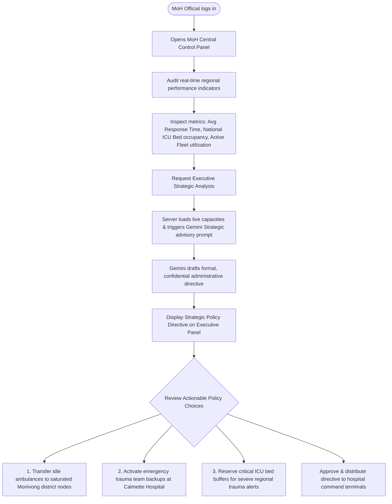
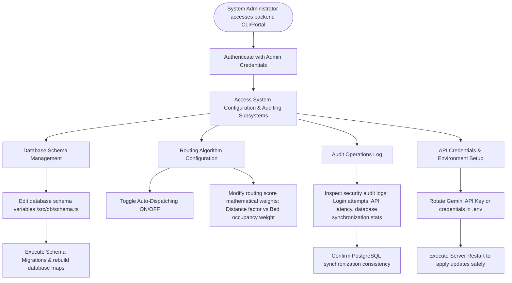

# USER FLOWS & INTERACTIVE JOURNEY MAPS
## Project: LifeLink AI — Cambodia Intelligent Emergency Medical Response Platform
### Role: Lead UX Architect & Interaction Designer
### Document Reference: LLA-UF-2026-V1
### Date: July 7, 2026

---

## 1. USER FLOWS OVERVIEW

This document outlines the detailed transaction, operation, and decision-making flows for all five core actors within the **LifeLink AI** ecosystem:
1. **Citizen Reporter**: Generating emergency reports via 119 bypass using multi-dialect NLP triage.
2. **Hospital ER Commander**: Managing capacity, intakes, and manual overrides.
3. **Ambulance Crew (Simulated)**: Receiving dispatch vectors, updating telemetry, and transiting.
4. **Ministry of Health (MoH) Administrator**: Auditing systemic bottlenecks and acting on executive-level strategic policy recommendations.
5. **System Administrator (Admin)**: Managing nodes, parameters, configurations, and fail-safe controls.

---

## 2. CITIZEN REPORTER FLOW (119 MULTI-DIALECT BYPASS)

The citizen portal prioritizes immediate, frictionless access. No application installation is required, and reports can be issued in Khmer, English, or conversational mixed slang.

---

## 3. HOSPITAL ER COMMANDER FLOW

Hospital ER coordinators operate on tablet or desktop screens inside the emergency department, monitoring incoming casualty workloads and managing trauma bed availability.

---

## 4. SIMULATED AMBULANCE FLEET WORKFLOW

Ambulance dispatch and transit coordinates are simulated dynamically to model actual traffic, geography, and response telemetry within Phnom Penh.

---

## 5. MINISTRY OF HEALTH (MoH) ADMINISTRATOR FLOW

MoH officials monitor regional performance indicators to optimize healthcare infrastructure investments and issue city-wide strategic directives.

---

## 6. SYSTEM ADMINISTRATOR (ADMIN) WORKFLOW

System administrators configure mathematical parameters, manage database schemas, audit operations, and manage API keys.

---
*End of User Flow Maps Specification.*
